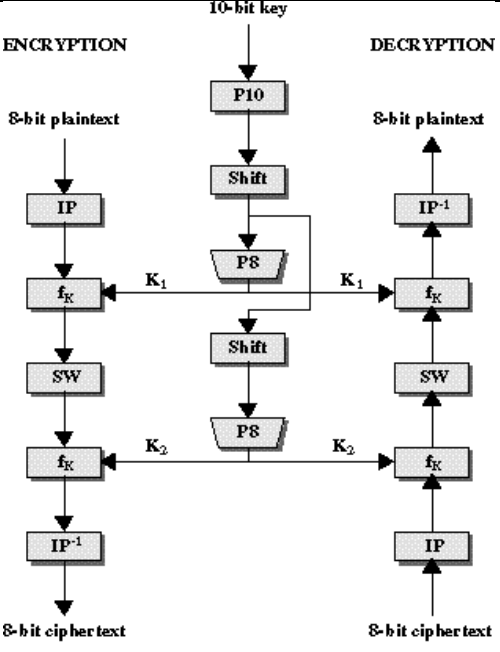

# Simplified DES

Simplified DES (S-DES) is an educational tool designed to help students learn the structure of DES using smaller blocks and keys.

- Feistal block cipher
- Plaintext: 8 bit
- Key: 10 bit
- Ciphertext: 8 bit



## Usage

Use the `SimplifiedDES` class in your program as follows.

For encryption:

```python
from sdes import SimplifiedDES

plaintext = 0b10101010
key = 0b1110001110
ciphertext = SimplifiedDES(key).encrypt(plaintext) # 0b11001010
```

For decryption:

```python
from sdes import SimplifiedDES

ciphertext = 0b11001010
key = 0b1110001110
plaintext = SimplifiedDES(key).decrypt(ciphertext) # 0b10101010
```

## References

- Check out `theory.pdf` for more information and worked out examples.
- [Simplified DES as an excel workbook](http://www.postcogito.org/Kiko/SimplifiedDESWorksheet.html)
- [Data Encryption Standard](https://en.wikipedia.org/wiki/Data_Encryption_Standard)

## Authors

[Mayank Jain](https://github.com/mayank-02)

## License

MIT
